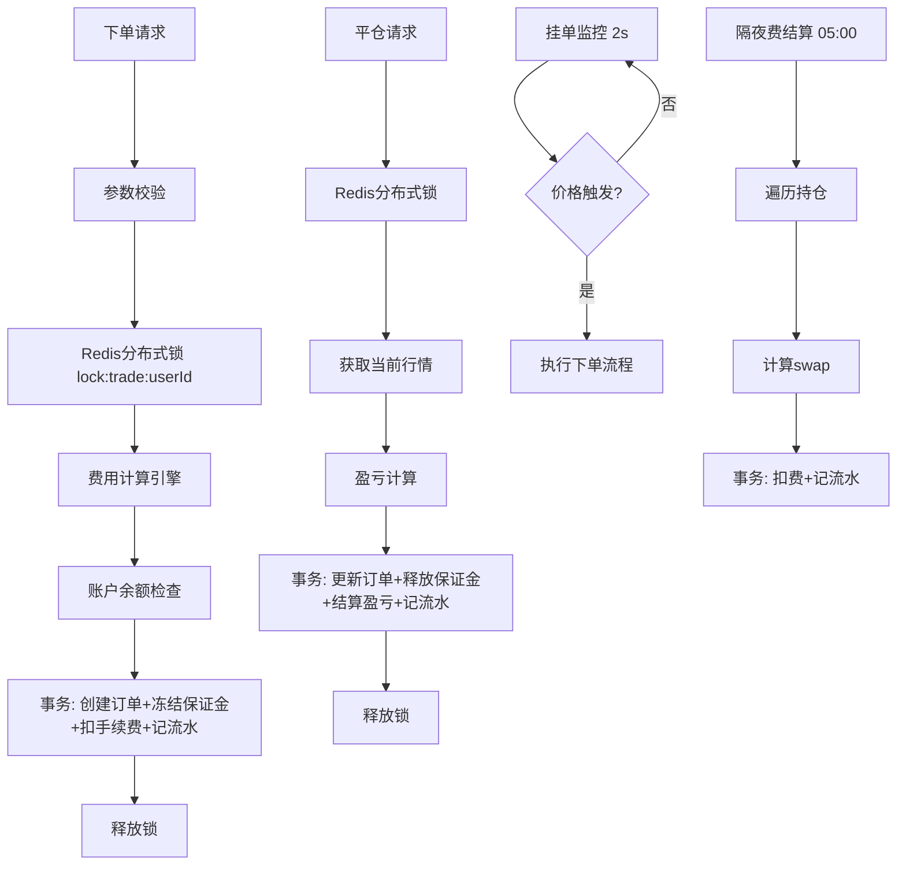
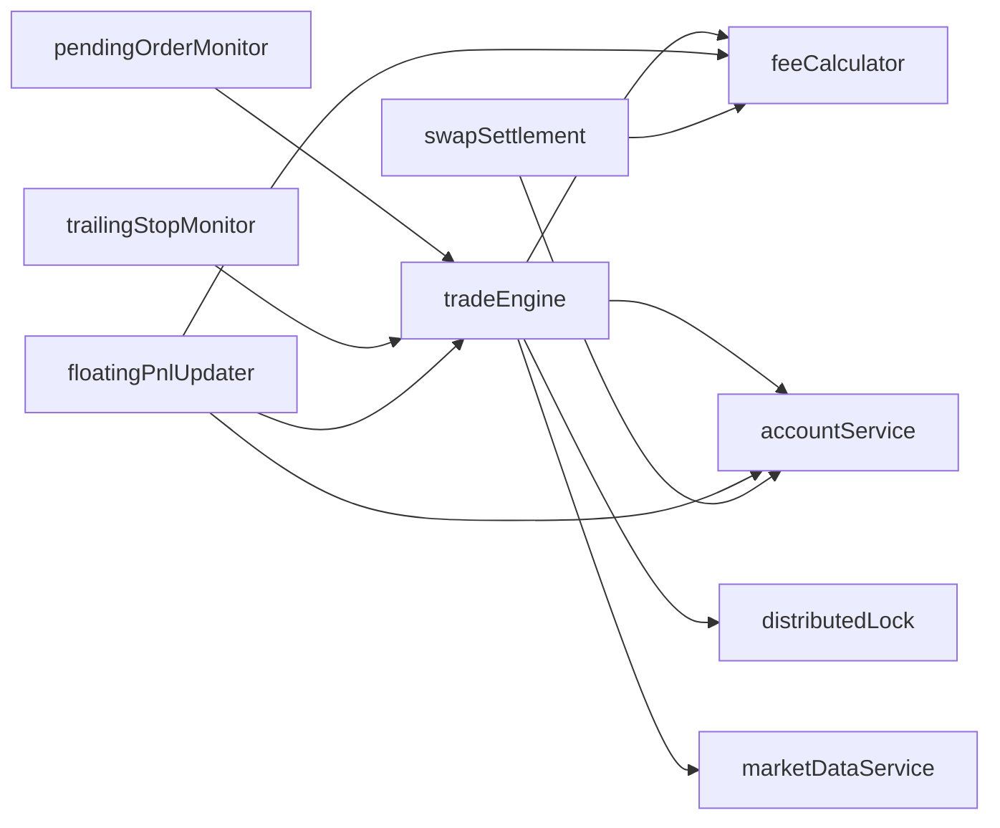
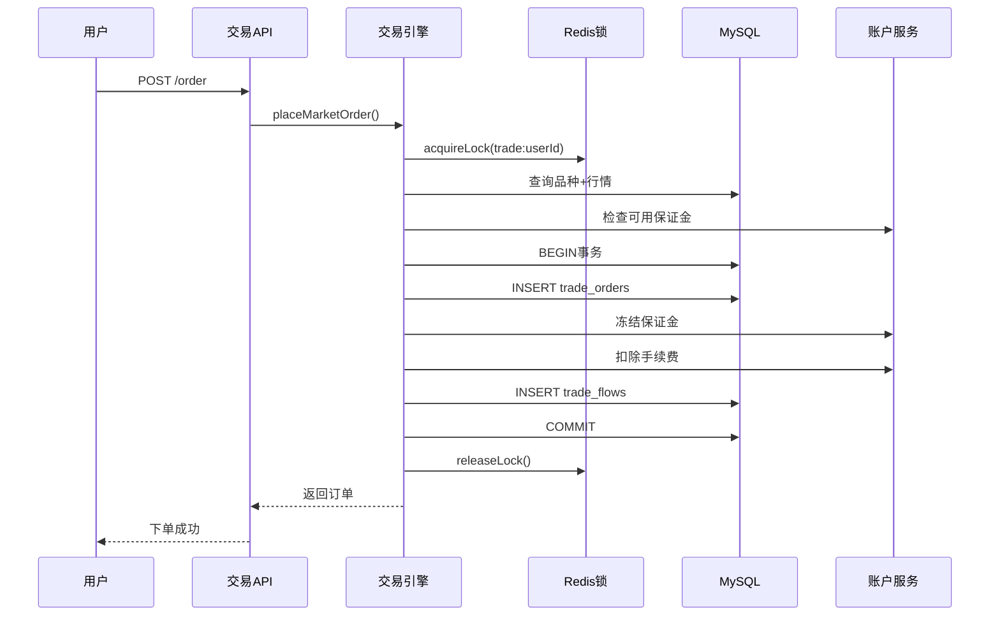

# DESIGN - 阶段三：交易引擎、订单、费用、账户体系

## 1. 整体架构图

## 2. 分层设计

| 层 | 文件 | 职责 |
|----|------|------|
| 路由层 | `routes/mobile/trade.js`, `routes/admin/trade.js` | 参数校验、请求转发 |
| 服务层 | `services/tradeEngine.js` | 交易核心逻辑 |
| 服务层 | `services/feeCalculator.js` | 费用计算 |
| 服务层 | `services/accountService.js` | 账户资金操作 |
| 定时任务 | `services/pendingOrderMonitor.js` | 挂单触发 |
| 定时任务 | `services/trailingStopMonitor.js` | 移动止损 |
| 定时任务 | `services/floatingPnlUpdater.js` | 浮动盈亏+止损止盈触发 |
| 定时任务 | `services/swapSettlement.js` | 隔夜费结算 |
| 工具层 | `utils/distributedLock.js` | Redis分布式锁 |
| 数据层 | `database/init.js` | 表结构定义 |

## 3. 核心组件

- **TradeEngine** (`tradeEngine.js`) — 交易引擎核心，处理市价单、挂单、平仓、止损止盈
- **FeeCalculator** (`feeCalculator.js`) — 6种费用计算：保证金、点差、开仓手续费、平仓手续费、隔夜费、净盈亏
- **AccountService** (`accountService.js`) — 资金账户管理，冻结/释放保证金，余额增减
- **PendingOrderMonitor** (`pendingOrderMonitor.js`) — 每2s检查活跃挂单，条件满足时触发下单
- **TrailingStopMonitor** (`trailingStopMonitor.js`) — 每2s更新移动止损价，触及时自动平仓
- **FloatingPnlUpdater** (`floatingPnlUpdater.js`) — 每3s更新浮动盈亏，检查止损止盈触发
- **SwapSettlement** (`swapSettlement.js`) — 每日05:00结算隔夜费，周三3倍
- **DistributedLock** (`distributedLock.js`) — Redis SET NX + Lua原子释放

## 4. 模块依赖关系图

## 5. 接口契约定义

### 用户端 `/api/mobile/trade`

| 方法 | 路径 | 请求体/参数 | 响应 |
|------|------|------------|------|
| GET | /symbols | - | 交易品种列表(含实时价格) |
| POST | /order | `{symbolId, direction, lots, leverage, stopLoss?, takeProfit?, trailingStop?, accountType}` | 订单对象 |
| POST | /pending | `{symbolId, direction, pendingType, lots, leverage, targetPrice, stopLoss?, takeProfit?, accountType}` | 挂单对象 |
| POST | /close/:id | - | 平仓后订单 |
| POST | /close-all | `{accountType}` | 平仓结果数组 |
| PUT | /order/:id/sltp | `{stopLoss?, takeProfit?, trailingStop?}` | 更新后订单 |
| PUT | /pending/:id | `{targetPrice?, lots?, stopLoss?, takeProfit?}` | 更新后挂单 |
| DELETE | /pending/:id | - | 撤销结果 |
| GET | /positions | `?accountType` | 持仓列表 |
| GET | /orders | `?accountType&status&page&pageSize` | 订单分页 |
| GET | /orders/:id | - | 订单详情+流水 |
| GET | /pendings | `?accountType&status` | 挂单列表 |
| GET | /account | `?accountType` | 账户概览 |
| POST | /estimate | `{symbolId, direction, lots, leverage}` | 费用预估 |

### 后台 `/api/admin/trade`

| 方法 | 路径 | 说明 |
|------|------|------|
| GET | /trade/orders | 订单列表(分页+筛选) |
| GET | /trade/orders/:id | 订单详情 |
| GET | /trade/positions | 持仓列表 |
| POST | /trade/orders/:id/close | 管理员平仓 |
| POST | /trade/orders/:id/cancel | 撤销订单/挂单 |
| PUT | /trade/orders/:id/price | 管理员改价 |
| GET | /trade/flows | 交易流水 |
| GET | /trade/statistics | 交易统计 |

## 6. 数据流向图

## 7. 异常处理策略

| 异常类型 | 处理方式 |
|----------|----------|
| 保证金不足 | 返回400错误，不执行下单 |
| 行情不可用 | 返回400错误，提示稍后重试 |
| 品种已禁用 | 返回400错误，不可交易 |
| 获取锁失败 | 返回错误，提示系统繁忙请稍后重试 |
| 持仓不存在 | 返回404 |
| 手数/杠杆超限 | 参数校验拦截，返回具体范围提示 |
| 止损止盈价格不合法 | 返回400，说明方向与价格关系 |

## 8. 数据库表结构设计

### fund_accounts 资金账户表
| 字段 | 类型 | 说明 |
|------|------|------|
| id | INT PK | 主键 |
| user_id | INT | 用户ID |
| account_type | ENUM(real,demo) | 账户类型 |
| balance | DECIMAL(20,4) | 账户余额 |
| frozen_margin | DECIMAL(20,4) | 已用保证金 |
| floating_pnl | DECIMAL(20,4) | 浮动盈亏 |
| total_deposit/withdraw/commission/swap/profit | DECIMAL(20,4) | 累计统计 |

### trade_orders 交易订单表
| 字段 | 类型 | 说明 |
|------|------|------|
| id | BIGINT PK | 主键 |
| order_no | VARCHAR(32) UNIQUE | 订单号 |
| user_id, account_type, symbol, direction, lots, leverage | - | 订单基本信息 |
| open_price, close_price | DECIMAL(20,8) | 价格 |
| stop_loss, take_profit, trailing_stop, trailing_stop_price | DECIMAL(20,8) | 止损止盈 |
| margin, commission, commission_close, swap_total, spread_cost | DECIMAL(20,4) | 费用 |
| floating_pnl, realized_pnl, net_pnl | DECIMAL(20,4) | 盈亏 |
| status | ENUM(open,closed,cancelled) | 状态 |
| close_type | ENUM(manual,stop_loss,take_profit,admin,trailing_stop,force_close) | 平仓方式 |

### pending_orders 挂单表
| 字段 | 类型 | 说明 |
|------|------|------|
| id | BIGINT PK | 主键 |
| pending_type | ENUM(buy_limit,buy_stop,sell_limit,sell_stop) | 挂单类型 |
| target_price | DECIMAL(20,8) | 目标价 |
| status | ENUM(active,triggered,cancelled,expired) | 状态 |
| triggered_order_id | BIGINT | 触发后生成的订单ID |

### trade_flows 交易流水表
| 字段 | 类型 | 说明 |
|------|------|------|
| id | BIGINT PK | 主键 |
| flow_type | ENUM(open,close,commission,swap,deposit,withdraw,bonus,adjust) | 流水类型 |
| amount | DECIMAL(20,4) | 金额(正入负出) |
| balance_before, balance_after | DECIMAL(20,4) | 变动前后余额 |
