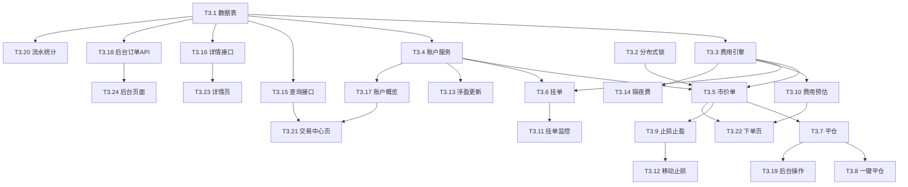

# TASK - 阶段三：交易引擎、订单、费用、账户体系

## 预估任务清单

| 任务ID | 任务名称 | 优先级 | 预估复杂度 | 依赖 | 状态 |
|--------|----------|--------|------------|------|------|
| T3.1 | 交易订单/挂单/资金账户数据表 | P0 | 中 | 阶段一、阶段二 | ✅ 已完成 |
| T3.2 | Redis 分布式锁工具 | P0 | 中 | 阶段一 | ✅ 已完成 |
| T3.3 | 费用计算引擎 | P0 | 高 | T3.1 | ✅ 已完成 |
| T3.4 | 交易账户服务 | P0 | 高 | T3.1 | ✅ 已完成 |
| T3.5 | 市价单下单接口 | P0 | 高 | T3.2, T3.3, T3.4 | ✅ 已完成 |
| T3.6 | 挂单创建接口 | P0 | 高 | T3.2, T3.3, T3.4 | ✅ 已完成 |
| T3.7 | 单笔平仓接口 | P0 | 高 | T3.5 | ✅ 已完成 |
| T3.8 | 一键平仓接口 | P0 | 中 | T3.7 | ✅ 已完成 |
| T3.9 | 止损止盈修改接口 | P0 | 中 | T3.5 | ✅ 已完成 |
| T3.10 | 费用预估接口 | P1 | 中 | T3.3 | ✅ 已完成 |
| T3.11 | 挂单监控定时任务(2s) | P0 | 高 | T3.6 | ✅ 已完成 |
| T3.12 | 移动止损监控定时任务(2s) | P0 | 高 | T3.9 | ✅ 已完成 |
| T3.13 | 浮动盈亏更新定时任务(3s) | P0 | 中 | T3.4 | ✅ 已完成 |
| T3.14 | 隔夜费结算定时任务 | P1 | 高 | T3.3 | ✅ 已完成 |
| T3.15 | 持仓/订单/挂单查询接口 | P0 | 中 | T3.1 | ✅ 已完成 |
| T3.16 | 订单详情接口 | P0 | 低 | T3.1 | ✅ 已完成 |
| T3.17 | 交易账户概览接口 | P0 | 中 | T3.4 | ✅ 已完成 |
| T3.18 | 后台订单管理接口 | P1 | 中 | T3.1 | ✅ 已完成 |
| T3.19 | 后台手动平仓/撤销/改价接口 | P1 | 中 | T3.7 | ✅ 已完成 |
| T3.20 | 后台交易流水/统计接口 | P1 | 中 | T3.1 | ✅ 已完成 |
| T3.21 | 用户端交易中心页 | P0 | 高 | T3.15, T3.17 | ✅ 已完成 |
| T3.22 | 用户端下单页 | P0 | 高 | T3.5, T3.10 | ✅ 已完成 |
| T3.23 | 用户端订单详情页 | P0 | 中 | T3.16 | ✅ 已完成 |
| T3.24 | 后台订单管理页面 | P1 | 高 | T3.18 | ✅ 已完成 |

## 任务依赖图

