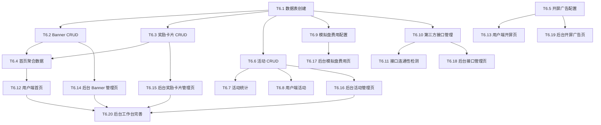

# TASK - 阶段六：后台运营能力、活动、Banner、奖励卡片、接口管理、开屏广告

## 预估任务清单

| 任务ID | 任务名称 | 优先级 | 预估复杂度 | 依赖 |
|--------|----------|--------|------------|------|
| T6.1 | 本阶段数据表创建 | P0 | 中 | 阶段五 |
| T6.2 | Banner CRUD 接口 | P0 | 中 | T6.1 |
| T6.3 | 奖励卡片 CRUD 接口 | P0 | 中 | T6.1 |
| T6.4 | 首页聚合数据接口 | P0 | 高 | T6.2, T6.3 |
| T6.5 | 开屏广告配置接口 | P1 | 低 | 阶段一(系统配置) |
| T6.6 | 活动 CRUD 接口 | P1 | 中 | T6.1 |
| T6.7 | 活动统计接口 | P1 | 低 | T6.6 |
| T6.8 | 用户端活动接口 | P1 | 低 | T6.6 |
| T6.9 | 模拟盘费用配置接口 | P0 | 高 | T6.1, 阶段二(品种) |
| T6.10 | 第三方接口管理接口 | P1 | 中 | T6.1 |
| T6.11 | 接口连通性检测 | P1 | 中 | T6.10 |
| T6.12 | 用户端首页完整实现 | P0 | 高 | T6.4 |
| T6.13 | 用户端开屏页完整实现 | P1 | 中 | T6.5 |
| T6.14 | 后台 Banner 管理页面 | P0 | 中 | T6.2 |
| T6.15 | 后台奖励卡片管理页面 | P0 | 中 | T6.3 |
| T6.16 | 后台活动管理页面 | P1 | 中 | T6.6 |
| T6.17 | 后台模拟盘费用页面 | P0 | 高 | T6.9 |
| T6.18 | 后台接口管理页面 | P1 | 中 | T6.10 |
| T6.19 | 后台开屏广告页面 | P1 | 中 | T6.5 |
| T6.20 | 后台工作台页面完善 | P1 | 中 | 多项依赖 |

## 任务依赖图

