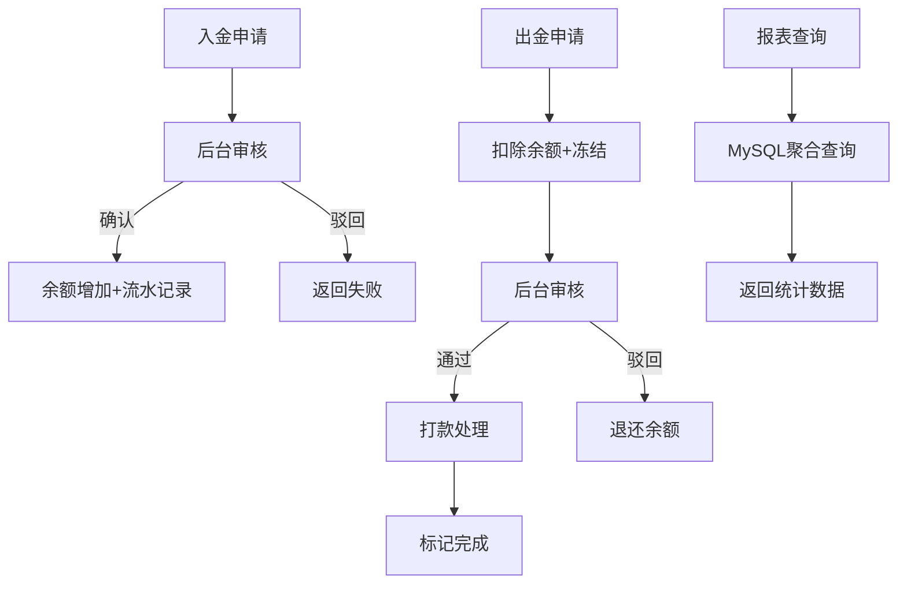

# DESIGN - 阶段四：资金审核、收款账户、流水、报表

## 1. 整体架构图

## 2. 分层设计

| 层 | 文件 | 职责 |
|----|------|------|
| 路由层 | `routes/mobile/fund.js` | 用户端资金13个接口 |
| 路由层 | `routes/mobile/report.js` | 用户端3种报表 |
| 路由层 | `routes/admin/fund.js` | 后台资金管理11个接口 |
| 路由层 | `routes/admin/report.js` | 后台3种报表 |
| 服务层 | `services/fundService.js` | 资金业务逻辑 |
| 服务层 | `services/reportService.js` | 报表聚合逻辑 |

## 3. 核心组件

- **FundService** — 入金/出金/审核/流水/收款账户/支付配置/手续费
- **ReportService** — 交易报表/盈亏报表/费用报表/运营概览/风控/用户分析

## 4. 接口契约定义

### 用户端资金 13个接口
- POST /deposit — 入金申请 {amount, payMethod, proofImage?, remark?}
- GET /deposits — 入金记录 {page, pageSize, status?}
- POST /withdraw — 出金申请 {amount, withdrawMethod, bankCardId?, qrcodeImage?, remark?}
- GET /withdraws — 出金记录 {page, pageSize, status?}
- GET /account — 资金账户信息 {accountType}
- GET /flows — 资金流水 {accountType, flowType?, page, pageSize}
- GET /fees — 费用汇总
- GET /withdraw-fee — 出金手续费估算 {amount}
- POST /bank-cards — 添加收款账户 {cardType, accountName, accountNo, qrcodeImage?}
- GET /bank-cards — 收款账户列表
- DELETE /bank-cards/:id — 删除
- PUT /bank-cards/:id/default — 设为默认
- GET /payment-config — 支付配置下发
- POST /upload-qrcode — 上传二维码图片

### 后台报表 3个接口（全部支持日期筛选）
- GET /report/operations — {startDate?, endDate?}
- GET /report/risk — {startDate?, endDate?}
- GET /report/user-analysis — {startDate?, endDate?}

## 5. 数据库表

- `deposits` — 入金申请表
- `withdraws` — 出金申请表
- `fund_flows` — 资金流水表
- `bank_cards` — 收款账户表（含qrcode_image字段）

## 6. 异常处理策略

| 异常类型 | 处理方式 |
|----------|----------|
| 余额不足（出金） | 返回错误，提示可用余额 |
| 重复提交入金 | 幂等校验 |
| 审核状态非法流转 | 校验当前状态后拒绝操作 |
| USDT 地址格式错误 | 前端+后端双重校验 |
| 二维码上传失败 | 返回错误提示 |
